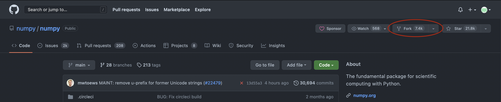

In this exercise will be very similar to what we just did but this time you
will be sent out in break-out rooms and work in pairs where you will
individually will begin by writing some code, a corresponding test and file an
issue. You will then fork your partners repository, fix the issue and submit a
pull request. This is exercise is also based on CodeReinery's [Full-cycle
collaborative
workflow](https://coderefinery.github.io/testing/full-cycle-ci/#). You can look
at their website if you are stucked and want an alternative source of information.

!!! question "What we will be doing"

    **This exercise takes around 20-30 min**

    
    - A: Create a repository on GitHub
    - B: Commit some code with errors and a corresponding test
    - C: Open an issue and report the bug
    - D: Your collegue has also done step A-C. Now, fork your collegues
      repository, clone it and fix the issue
    - E: Push your fix to GitHub and merge the pull request

## Step 1: Create a new repository on GitHub

Create a new repository where you will host your code and tests and share the
url for cloning to your colleague. **Important**: Make sure that you and your
colleague have chosen different names. 

## Step 2: Clone your repository, add program + tests and commit + push

Begin by cloning your own repository. 

You should now add the code you want to test. You are encouraged to come up
with your own example but please make it simple (Or at least the FIX simple)!
If you want you can use the `reverse_string.py` code from before or you can
write your own program. Below I have also included two other examples that you
could use.

??? example "Stack implementation" 
    
    In this example we will implement the Stack data-structure that you learned
    about on Tuesday during Marcus lecture. We will do so using a linked list.

    ```python title="data_structures.py" linenums="1"
    class Node:
        """
        A node stores the item of the element in the linked-list as well as
        keeps a pointer to the next node.
        """

        def __init__(self, item, next):
            self.item = item
            self.next = next


    class Stack:
        """
        Stack implemented using linked list.
        Last in first out (LIFO).
        """
        def __init__(self, head=None):

            self.head = head # Pointer to first (last inserted) element

        def pop(self):
            """
            Removes and returns the last added element
            """

            if not self.head:
                raise ValueError("List is empty")

            # FIXME: This is the mistake! It should return the item of the head node!
            item = self.head.next.item

            self.head = self.head.next

            return item

        def push(self, new_item):
            """
            Push new item to stack
            """

            self.head = Node(item=new_item, next=self.head)

    ```
    And the test. Run it to see what is going wrong!

    ``` python title="test_stack.py" linenums="1"
    from data_structures import Stack


    def test_stack():

        stack = Stack()
        teachers = ("Matias", "Björn", "Lars", "Jon", "Marcus", "Per")

        for teacher in teachers:

            stack.push(teacher)

        assert stack.pop() == "Per"
    ```

??? example "Dijkstra's two-stack algorithm" 

    Dijkstra's two-stack is my favorite algorithm (I think). It can be used to parse
    and correctly evaluate mathematical expression with parenthesis. Its simple
    but yet powerfull! The example here is very minimal and contains a bug on
    line 31 that must be fixed. BONUS: run the algorithm with pen and paper
    (perhaps at a later point) to convince yourself why it works. You can read
    more about it
    [here](https://hackernoon.com/building-your-own-programming-language-from-scratch-part-ii-dijkstras-two-stack-algorithm)
    and Advent of code had a question on day 18 of 2020 which could be solved with
    this algorithm: <https://adventofcode.com/2020/day/18>.

    ``` python title="algorithms.py" linenums="1"
    def dijkstra_two_stack(math_expr: str):
        """
        Evaluates parenthesised mathematical expression 
        """

        operator_stack = []
        value_stack = []
        accepted_operators = "+-*"
        
        # Loop over chars in expression
        for c in math_expr.strip():

            if c in accepted_operators:
                operator_stack.append(c)

            elif c.isnumeric():
                value_stack.append(int(c))

            elif c == ")":

                val = value_stack.pop()

                operator = operator_stack.pop()

                if operator == "+":

                    val += value_stack.pop()

                elif operator == "-":

                    val -= value_stack.pop()

                elif operator == "*":
                    
                    # FIXME: This should be multiplication!
                    val /= value_stack.pop()

                value_stack.append(val)

        return value_stack.pop()
    ```

    and the test!

    ``` python title="test_dijkstra_two_stack.py" linenums="1"
    from algorithms import dijkstra_two_stack

    def test_dijsktra_two_stack():

        expression_1 = "( ( 1 + 2 ) * 3 )"
        expression_2 = "( 1 + ( ( 2 + 3 ) * ( 4 * 5 ) ) )"

        assert dijkstra_two_stack(expression_1) == 9
        assert dijkstra_two_stack(expression_2) == 101
    ```

## Step 3: Add the workflow to your repository

This time you can try adding the workflow manually by creating
`.github/workflows/python-app.yml` yourself. You can copy the content from the
previous exercise. If you decide to do it this way remember that you need to
add, commit and push the file. Conversely, if you do it directly on GitHub you
will have to pull the changes to your local repository. 

??? tip 
    ``` bash
    mkdir -p .github/workflows
    cd .github/workflows
    vim python-app.yml # Open in your favorite editor and add workflow
    git add python-app.yml & git commit -m "Added workflow"
    git push
    ```

## Step 4: Verify that the test ran (but failed) and open issue

Check that `pytest` ran as you expected by failing to complete the test.
Afterward, create an issue with a reasonable title and you can also add a
description if you wish.

## Step 5: Fork and clone the repository of your colleague

This is a completely new step from the last exercise. You should begin by
forking the repository of your colleague. Use the url to navigate to the GitHub
page and then click fork:



You can read about creating pull requests using a fork here:

* <https://docs.github.com/en/pull-requests/collaborating-with-pull-requests/proposing-changes-to-your-work-with-pull-requests/creating-a-pull-request-from-a-fork>

and more generally about forking here:

* <https://docs.github.com/en/get-started/quickstart/fork-a-repo>. 


After you have forked the repository you should clone your fork so that you
have it  locally. This will probably look something like this:

``` bash
git clone git@github.com:your-username/name-of-collegue-repo.git
```

## Step 6: Make the test pass!

Now that you have forked the repo of your colleague, it is time to inspect the
issue and fix the code so that the test passes! Before making any commits you
can verify locally with `pytest`. 

## Step 7: Create a pull request

You are now ready to create a pull request by commiting and pushing your fix.
As long as you reference the issue number in the commit message GitHub and use
a keyword like *closes* (see
[here](https://docs.github.com/en/issues/tracking-your-work-with-issues/linking-a-pull-request-to-an-issue)
for more) GitHub will create it for you. 

Once done, you can ask your colleague to review the pull request!


## Step 8: Merge pull request

Now going back to your own repository again, review the pull request your
colleague suggested. If the tests passed and you are happy with the fix you can
merge it to the main branch. You are now done with the exercise!
