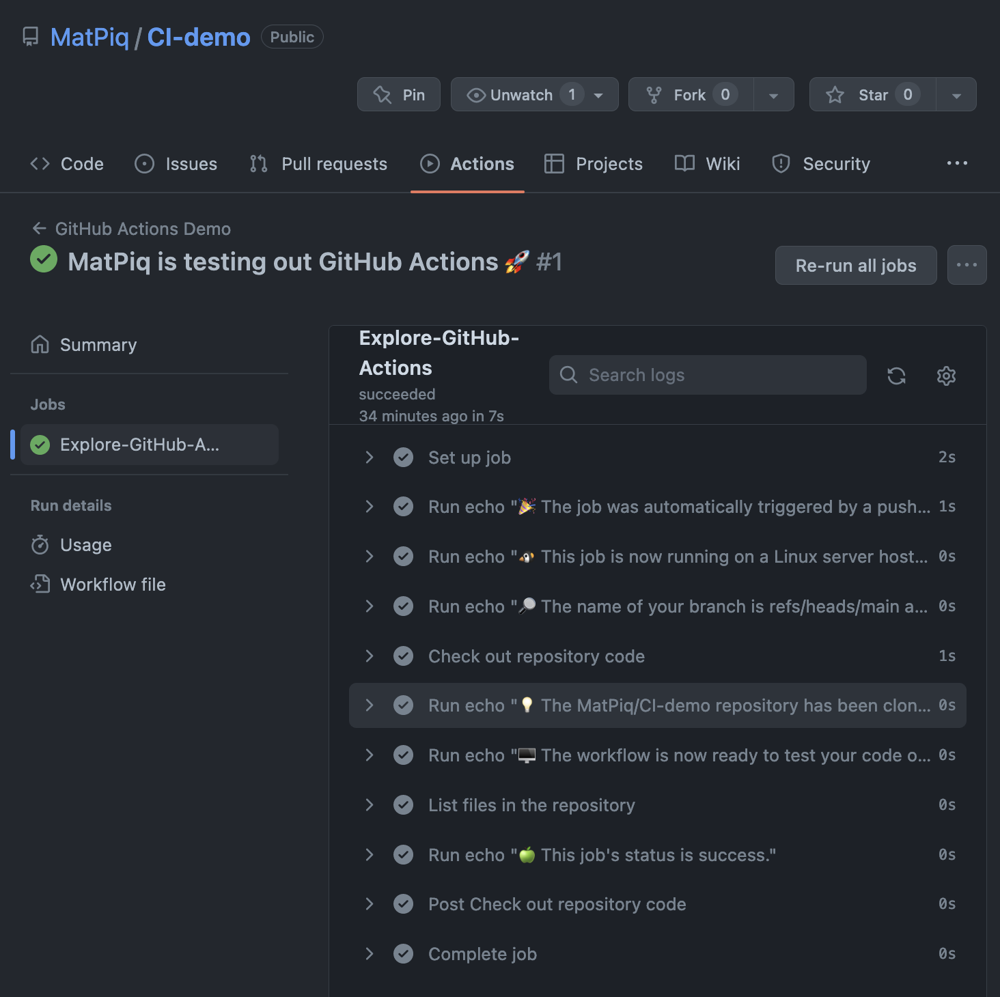

Github actions lets you automate the process of testing (and much more). 

!!! 


## A first look

We will now take a first look at GH Actions using the example from Github's
quickstart [guide](https://docs.github.com/en/actions/quickstart). 

### Step 1
We need to create a repository on Github. Have have prepared one
   [here](https://github.com/MatPiq/CI-demo). 

### Step 2
Next, I will clone the repository locally and enter the project

``` bash
git clone git@github.com:MatPiq/CI-demo.git
cd CI-demo
```
### Step 3

We create the `.github/workflows` directory and add the
   `github-actions-demo.yml` file. 

  ``` bash 
  mkdir -p .github/workflows
  touch .github/workflows/github-actions-demo.yml
  ```


The directory should look something like this:

``` bash
├── .git
├── .github
│   └── workflows
│       └── github-actions-demo.yml
└── README.md
```

We can now paste the example workflow into `github-actions-demo.yml`. For
example using vim:

```
vim .github/workflows/github-actions-demo.yml
```

``` yaml title="github-actions-demo.yml"
name: GitHub Actions Demo
run-name: ${{ github.actor }} is testing out GitHub Actions 🚀
on: [push]
jobs:
  Explore-GitHub-Actions:
    runs-on: ubuntu-latest
    steps:
      - run: echo "🎉 The job was automatically triggered by a ${{ github.event_name }} event."
      - run: echo "🐧 This job is now running on a ${{ runner.os }} server hosted by GitHub!"
      - run: echo "🔎 The name of your branch is ${{ github.ref }} and your repository is ${{ github.repository }}."
      - name: Check out repository code
        uses: actions/checkout@v3
      - run: echo "💡 The ${{ github.repository }} repository has been cloned to the runner."
      - run: echo "🖥️ The workflow is now ready to test your code on the runner."
      - name: List files in the repository
        run: |
          ls ${{ github.workspace }}
      - run: echo "🍏 This job's status is ${{ job.status }}."
```

!!! note "YAML syntax"
    * `name`: Name of workflow shown under "Actions" tab
    * `run-name`: Name specific for the run
    * `on`: When the workflow should be triggered e.g. push, pull request (can
      be several)
    * `runs-on`: Which virtual machine to run the tests on
    * `steps`: Logically separated  "tasks" in your workflow. A step can run
      commands or an action. Changes to environment variables are not preserved
      between steps. 
    * `run`: 

    There are many more options available that can be found
    [here](https://docs.github.com/en/actions/using-workflows/workflow-syntax-for-github-actions#about-yaml-syntax-for-workflows).

### Step 4

We will now commit and push the changes to Github and inspect the workflow.

``` bash
git add . 
git commit -m "Added demo workflow"
git push
```

### Step 5

We can now go to ["Actions"](https://github.com/MatPiq/CI-demo/actions) tab in
the repository on Github to inspect our workflow. 




!!! info "Examples from the wild"
    * [numpy](https://numpy.org/devdocs/dev/index.html): Various continuous
      integration (CI) services are triggered after each PR update to build the
      code, run unit tests, measure code coverage and check coding style of
      your branch. The CI tests must pass before your PR can be merged. If CI
      fails, you can find out why by clicking on the “failed” icon (red cross)
      and inspecting the build and test log. To avoid overuse and waste of this
      resource, test your work locally before committing.
    * [scikit-learn]()


