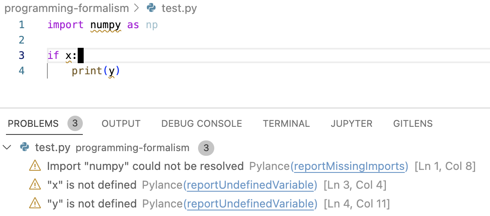

We are now going to see other parts of the development that be automated using
GH Actions in order improve the quality of the code base. We will continue with
Python and look at some modern and common tools used popular projects.


## Linting

Linting is a form of static code analysis that looks for and warns about code
smells, possible errors and bad style in your code. You have probably seen this
already if you are using a modern IDE like vscode or Pycharm with a built-in
language server. 



A popular *linter* for Python that can be used directly from the command line
(It can also be integrated into an IDE) is
[`Flake8`](https://flake8.pycqa.org/en/latest/#). Let us create a new file in
the repository we created for automating `pytest`.

``` bash
touch src/linting.py
```

``` python title="linting.py"


```

## Static type-checking


## Formatting

How your code is formatted matters for the readability. This is a hot topic and
people have different styles and preferences. When working together however, it
is often more important that the style is coherent than which exact style to
use. 

In Python some of the most popular formatters are:

* [`Black`](https://github.com/psf/black)
* [`autopep8`](https://github.com/hhatto/autopep8)
* [`YAPF`](https://github.com/google/yapf)

We will be looking using `Black` since this is the mostly commonly used

!!! quote "Black - The Uncompromising Code Formatter"
    Black is the uncompromising Python code formatter. By using it, you agree
    to cede control over minutiae of hand-formatting. In return, Black gives
    you speed, determinism, and freedom from pycodestyle nagging about
    formatting. You will save time and mental energy for more important
    matters.


``` python

```

## Automated refactoring


!!! info "Examples from the wild"
    * [numpy](https://numpy.org/devdocs/dev/index.html): Various continuous
      integration (CI) services are triggered after each PR update to build the
      code, run unit tests, measure code coverage and check coding style of
      your branch. The CI tests must pass before your PR can be merged. If CI
      fails, you can find out why by clicking on the “failed” icon (red cross)
      and inspecting the build and test log. To avoid overuse and waste of this
      resource, test your work locally before committing.
    * [scikit-learn]()
