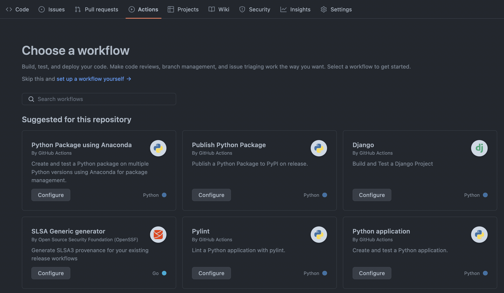

## Type-along automating `pytest`

We are now going to continue working on the test example using `pytest`
introduced by Per. This time we will use the power of github actions to
automatically run the tests for us. 

!!! note
    This code-along as well as the exercise we will be doing are based on the
    fantastic CodeRefinery workshop and their introduction to automated
    testing:
    <https://coderefinery.github.io/testing/continuous-integration/#type-along-exercise-continuous-integration>.
    They also include examples for testing in other languages like `Fortran,
    Julia, R` and `C++`. 


!!! question "What we will be doing"
    - A: Create a repository on GitHub
    - B: Commit Per's test example (The tests will not pass at this point)
    - C: Open an issue and report the bug
    - D: Create a new branch to fix the bug and open a pull request
    - E: Merge the pull request into the main branch

### Step 1: Create a new repository on GitHub

Go to [GitHub](https://github.com/) and create a new repository. 

### Step 2: Clone your repository, add program + tests and commit + push

Begin by cloning the repository you just created. Then add the
`reverse_string.py`. Note that we include a mistake in the code so that our
test will fail (it should be easy to spot!).

``` python title="reverse_string.py" linenums="1"

def reverse_string(s):
    return s[::-1][::-1]
```

Next, we add the corresponding test `test_reverse_string.py`. Note that
`pytest` will automatically run any module named `test_*.py` or `*_test.py`. 

``` python title="test_reverse_string.py" linenums="1"
from reverse_string import reverse_string


def test_reverse():
    # Arrange - set up the test case
    s = 'paris'

    # Act - perform the action we are testing
    result = reverse_string(s)

    # Assert - check that the action performed correctly
    assert result == 'sirap'
```

Running `pytest .` in the directory should now produce the following output:

``` 
====================================== test session starts ======================================
platform darwin -- Python 3.10.6, pytest-7.1.3, pluggy-1.0.0
rootdir: /Users/matpi832/Projects/programming-formalism/automated_testing
collected 1 item

test_string_manipulation.py F                                                             [100%]

=========================================== FAILURES ============================================
_________________________________________ test_reverse __________________________________________

    def test_reverse():
        # Arrange - set up the test case
        s = 'paris'

        # Act - perform the action we are testing
        result = reverse_string(s)

        # Assert - check that the action performed correctly
>       assert result == 'sirap'
E       AssertionError: assert 'paris' == 'sirap'
E         - sirap
E         + paris

test_string_manipulation.py:12: AssertionError
==================================== short test summary info ====================================
FAILED test_string_manipulation.py::test_reverse - AssertionError: assert 'paris' == 'sirap'
======================================= 1 failed in 0.02s =======================================
```

!!! note "What our project directory should look like"
    ``` bash
    $ls -l 
    .git
    reverse_string.py
    test_reverse_string.py
    README.md
    ```

We should now be ready to add the files we have created, commit and push.

``` bash
git add . & git commit -m "Initial commit"
git push
```

## Step 3: Create CI workflow

The next step is to create an actions workflow that runs our tests. There are
two ways to do this. Either we can do as before by manually adding the workflow
yaml under `.github/workflows`, or, we can also add it directly through GitHub.

### Alternative 1: Adding through GitHub

Go to your repository and choose click on the *Actions* tab. Then configure the
*Python application*





### Alternative 2: Adding manually

Create the file `.github/workflows/python-app.yml`, then commit and push it to
GitHub. 

``` yaml title="python-app.yml"
# This workflow will install Python dependencies, run tests and lint with a single version of Python
# For more information see: https://help.github.com/actions/language-and-framework-guides/using-python-with-github-actions

name: Python application

on:
  push:
    branches: [ main ]
  pull_request:
    branches: [ main ]

permissions:
  contents: read

jobs:
  build:

    runs-on: ubuntu-latest

    steps:
    - uses: actions/checkout@v3
    - name: Set up Python 3.10
      uses: actions/setup-python@v3
      with:
        python-version: "3.10"
    - name: Install dependencies
      run: |
        python -m pip install --upgrade pip
        pip install flake8 pytest
        if [ -f requirements.txt ]; then pip install -r requirements.txt; fi
    - name: Test with pytest
      run: |
        pytest example.py
```


## Step 4: Open an Issue on GitHub

Now that we have automated the test and we can see that it is failing, it is
time to open an issue on GitHub. Click on the *issues* tab and then *New
issue*. Let us call it *reverse string is broken*. 

## Step 5: Fix the issue and submit pull request

We will now create a new branch where we fix the issue in `reverse_string.py`
and submit a pull request. 

``` bash
# Create and checkout new branch
git checkout -b matias/bugfix-reverse_string
```

We can link the commit to the issue by using the keyword resolve (See more
[here](https://docs.github.com/en/issues/tracking-your-work-with-issues/linking-a-pull-request-to-an-issue)). 

``` bash
git add reverse_string.py
git commit -m "fix reverse_string.py, closes #1"
```


We should verify locally that the tests pass before pushing to GitHub. Remember
to set the upstream to the new branch. 

``` bash
git push --set-upstream origin matias/bug-fix
```


## Step 6: Accept pull request

In this last step we will review the pull request on GitHub and verify that it
indeed fixes the issue in `reverse_string.py`. Since we used the keyword
*closes* the issue will be automatically closed as we accept the pull request
and merge the fix into the main branch of the repository. 
